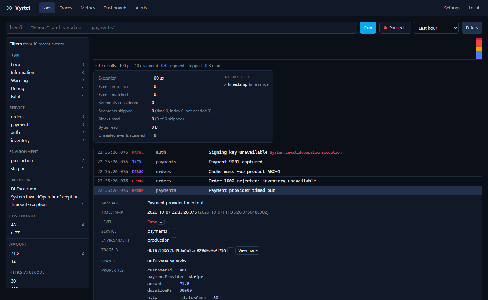
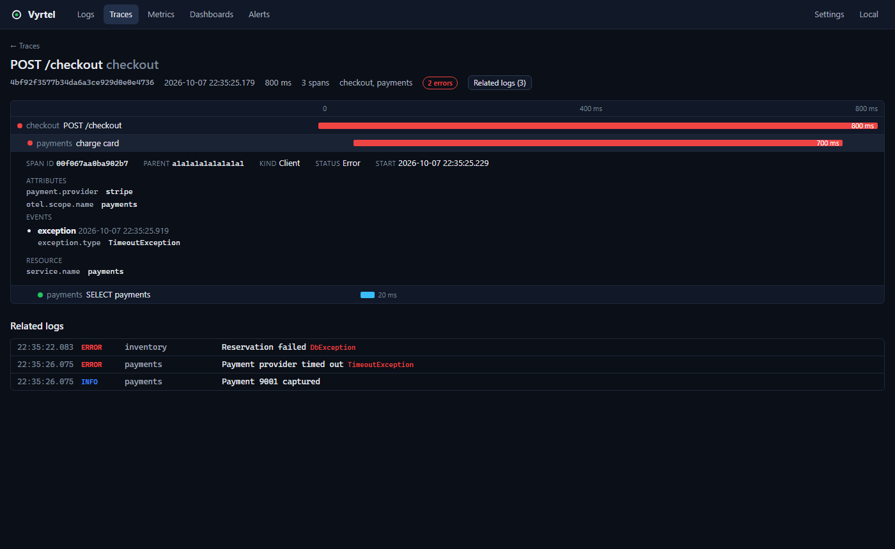
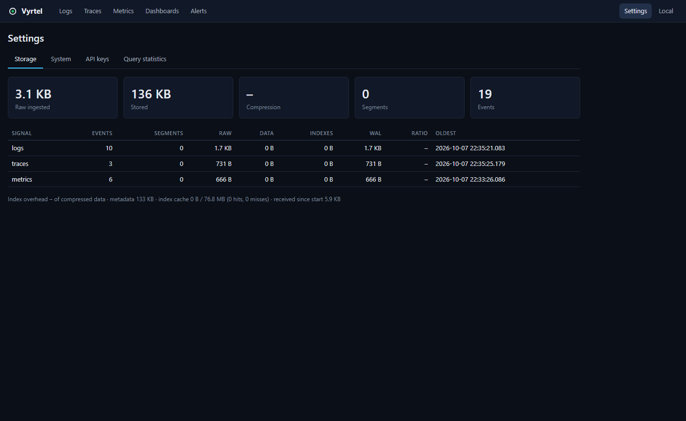

# Vyrtel

**Small, fast, self-hosted observability.** Structured logs, traces and
metrics in one ~11 MB binary with one data directory and no external
services.

> Observability should not require more resources than the software being
> observed.

```
docker run -p 8080:8080 -v vyrtel-data:/data vyrtel
```

```
Vyrtel 0.1.0

Data directory      /data
HTTP                http://0.0.0.0:8080
OTLP HTTP           http://0.0.0.0:8080/v1/*
Storage             0 B
Memory limit        512 MB
Durability          normal
Authentication      disabled (open access; see docs/configuration.md)

Ready.
```

Open <http://localhost:8080> and you get **Logs · Traces · Metrics ·
Dashboards · Alerts**. No setup wizard, no database connection string, no
cluster configuration.



| Trace waterfall with related logs | Storage statistics |
|---|---|
|  |  |

(Regenerate with `SCREENSHOTS=1 npx playwright test screenshots` in `web/`.)

## What problem it solves

Most observability stacks need a search cluster, a time-series database, a
message queue and a few gigabytes of RAM before they show their first log
line. Vyrtel is for teams and side projects that want good structured-log
search, basic tracing and metrics **without operating infrastructure**:

* one process (HTTP API, OTLP ingestion, query engine, storage, metadata,
  web UI, background jobs);
* one data directory (`./data`), crash-safe, with bounded memory;
* idle at ~20 MB of RAM; 10,000 events/s on a laptop with ~110 MB.

## Features

* **Logs** (the hero feature): structured JSON/NDJSON ingestion (Serilog
  CLEF compatible), a small query language
  (`level = "Error" and http.statusCode >= 500`), live tail with
  pause/resume, vertical event inspection with exceptions and stack traces,
  filter panel with detected fields, compact histogram, and **query
  diagnostics** showing exactly which segments, blocks and indexes were used.
* **OpenTelemetry**: OTLP/HTTP for logs, traces and metrics (protobuf or
  JSON, gzip).
* **Traces**: search, waterfall view, span details, logs ↔ trace navigation.
* **Metrics**: counters, gauges and histograms with sum/count/min/max/avg/last
  and group-by, plotted over time.
* **Dashboards**: log count, metric line, single statistic and saved query
  panels on a simple grid.
* **Alerts**: log-count threshold alerts with OK/FIRING/ERROR state, history
  and webhook delivery.
* **Storage you can see**: append-only WAL with CRCs, immutable zstd
  segments with time ranges, bitmap indexes, Bloom filters and zone maps;
  compression ratio and index overhead are shown in Settings → Storage.
* **Operations**: per-signal retention, compaction, crash recovery,
  `strict`/`normal` durability, API keys, admin login, health/readiness
  endpoints, Docker image running as non-root.

## Quick start

### From source

Requirements: Rust (stable), a C compiler, Node.js 22+.

```bash
git clone <this repository> vyrtel && cd vyrtel
cd web && npm ci && npm run build && cd ..
cargo run --release -p server
```

### Docker

```bash
docker build -t vyrtel .
docker run -p 8080:8080 -v vyrtel-data:/data vyrtel
```

(For a bind mount such as `-v ./vyrtel-data:/data` on Linux, make the
directory writable by uid 65532 first — see
[configuration](docs/configuration.md#docker-and-bind-mounts).)

### Send your first event

```bash
curl -X POST http://localhost:8080/api/v1/events \
  -H 'content-type: application/json' \
  -d '{
    "level": "Error",
    "service": "payments",
    "message": "Payment failed",
    "traceId": "abc123",
    "properties": { "customerId": 481, "paymentProvider": "stripe", "amount": 71.50 },
    "exception": { "type": "TimeoutException", "message": "Payment provider timed out" }
  }'
```

…or point any OpenTelemetry SDK / Collector at it:

```bash
export OTEL_EXPORTER_OTLP_ENDPOINT=http://localhost:8080
export OTEL_EXPORTER_OTLP_PROTOCOL=http/protobuf
```

Want realistic data? `cargo run --release -p loadgen -- --rate 1000 --duration 60s --traces-every 200`.

### Run a query

In the UI type `level = "Error" and service = "payments"` and press Enter,
or:

```bash
curl -X POST http://localhost:8080/api/v1/query/logs \
  -H 'content-type: application/json' \
  -d '{"query": "customerId = 481 and message contains \"failed\"", "from": "-1h"}'
```

More examples:

```
durationMs > 500
http.statusCode >= 500 and not environment = "staging"
traceId = "4bf92f3577b34da6a3ce929d0e0e4736"
level >= Warning and (service = "orders" or service = "payments")
"timed out"
```

See [docs/query-language.md](docs/query-language.md).

## Development

```bash
cargo run -p server -- --data-dir ./data-dev     # API on :8080
cd web && npm ci && npm run dev                   # UI with hot reload on :5173
```

Details: [docs/development.md](docs/development.md).

## Testing

```bash
cargo test --workspace                 # unit, property, recovery, correctness, integration
cd web && npm test                     # Vitest + React Testing Library
cd web && npm run build && cd .. && cargo build -p server && cd web && npx playwright install chromium && npm run e2e
cargo bench -p storage -p query        # Criterion benchmarks
```

Details: [docs/testing.md](docs/testing.md).

## Measured numbers

Release build on a Windows 11 laptop (numbers vary with hardware and data
shape; see [docs/testing.md](docs/testing.md) for method):

| | |
|---|---|
| Binary size (with embedded UI) | 11.2 MB |
| Idle memory | ~20 MB working set (4.7 MB private) |
| Sustained ingest via `loadgen --rate 10000` | 10,063 events/s, 0 rejected, 5.3 ms mean request latency |
| Memory while ingesting 300k events | ~112 MB working set |
| Compression on loadgen data | 4.9× (raw encoded ÷ segment data + indexes) |
| Index + metadata overhead | 9.2% of compressed data |
| External services required | 0 |

## Documentation

* [Architecture](docs/architecture.md) — process layout, ingestion, storage and query paths
* [Storage format](docs/storage-format.md) — WAL, segments, indexes, commit & recovery
* [Query language](docs/query-language.md)
* [HTTP API](docs/api.md)
* [Configuration](docs/configuration.md)
* [Development](docs/development.md)
* [Testing](docs/testing.md)
* [Roadmap](docs/roadmap.md)

## Current limitations

* Single node only; no replication or clustering (by design for v0.1).
* OTLP over HTTP only (no gRPC). Exponential histograms and summaries keep
  only count/sum.
* `message contains` scans (no full-text index yet); no regex or wildcards.
* Metrics aggregation works on raw data points (no rate() for cumulative
  counters, no percentiles yet).
* Alerts: log-count thresholds with a generic webhook only.
* Authentication is a single admin user plus API keys; it is **off by
  default** — enable it before exposing Vyrtel, and terminate TLS in a
  reverse proxy.
* Retention is per signal at segment granularity.

## Roadmap

Adaptive indexing from the recorded query statistics, full-text message
index, per-service retention, OTLP/gRPC, richer alert routing, object-storage
tiering. See [docs/roadmap.md](docs/roadmap.md).

## License

MIT — see [LICENSE](LICENSE).
