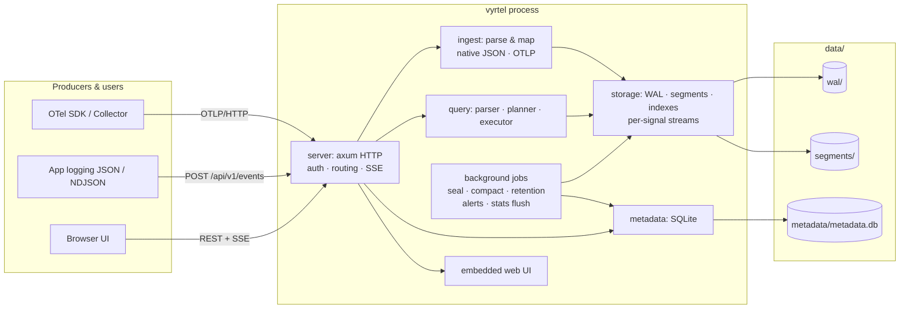
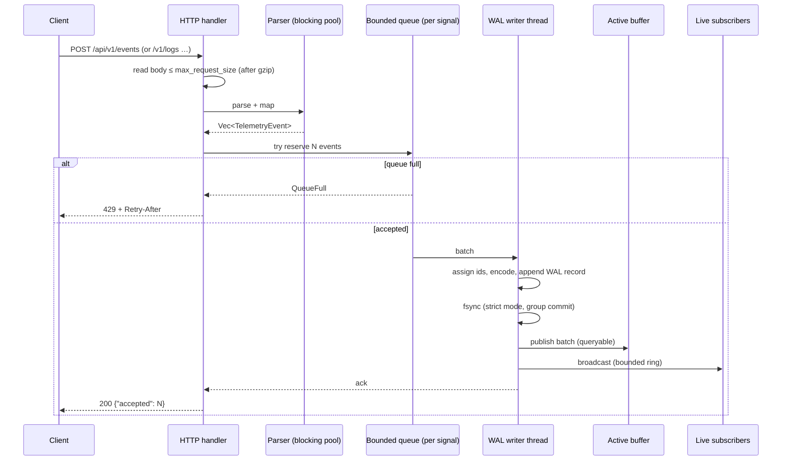
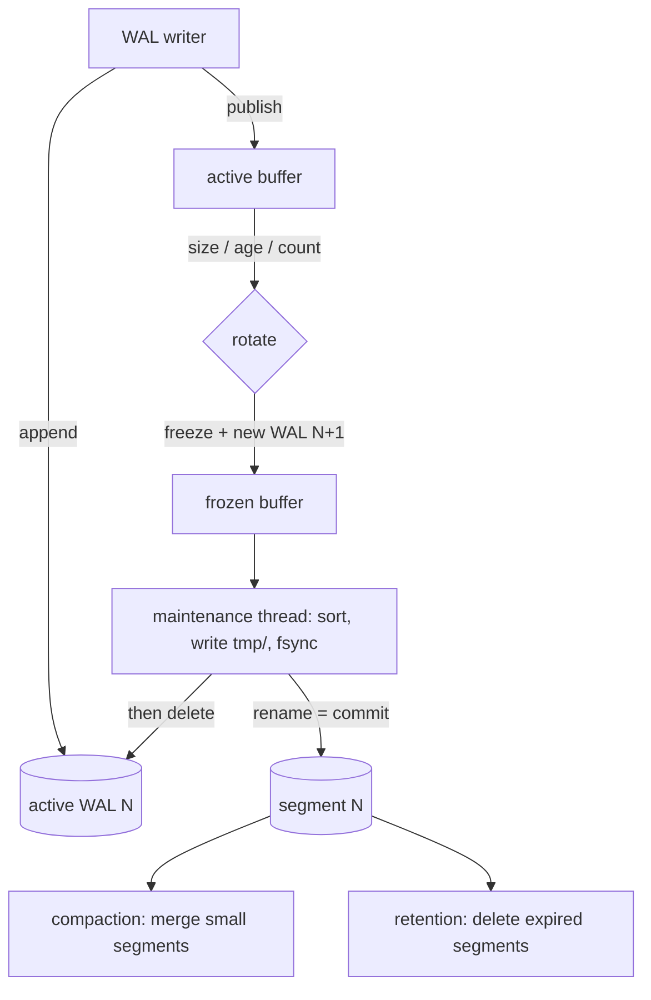

# Architecture

Vyrtel is **one process** with **one data directory**. Crates are code
boundaries, not network boundaries.

| Crate           | Responsibility                                                                                         | Depends on         |
|-----------------|--------------------------------------------------------------------------------------------------------|--------------------|
| `telemetry`     | Common event model (`TelemetryEvent`, `Fields`, `Value`), JSON view                                    | –                  |
| `storage`       | Event codec, WAL, segment format, indexes, recovery, sealing, compaction, retention, index cache       | telemetry          |
| `query`         | Lexer, parser, AST, evaluator, index pruning, executor, aggregations, traces, query stats              | telemetry, storage |
| `ingest`        | Native JSON/NDJSON and OTLP (protobuf + JSON) → `TelemetryEvent`                                       | telemetry          |
| `metadata`      | SQLite: migrations, settings, users/sessions, API keys, dashboards, saved queries, alerts, query stats | –                  |
| `server`        | Config, HTTP API, auth, live tail, alert evaluator, embedded UI, binary                                | all                |
| `tools/loadgen` | Load generator                                                                                         | –                  |

## Ingestion path

* Every queue is bounded: request bodies (semaphore), events per signal
  (`queue_capacity`), the writer channel, and the live-tail ring.
* The writer drains whatever is queued into one group commit, so `strict`
  durability costs one fsync per group, not per request.
* A request is acknowledged only after its WAL record is written (and
  fsynced in strict mode) **and** visible to queries.

## Storage path

Each signal (logs, traces, metrics) is an independent stream with its own
writer thread, maintenance thread, WAL files, segments and retention. See
[storage-format.md](storage-format.md) for file layouts, the commit
procedure and recovery.

## Query path

```mermaid
flowchart LR
    T[query text] --> LX[lexer] --> PS[parser] --> AST[AST]
    AST --> CMP[compile: resolve fields, pre-process literals]
    CMP --> SNAP[storage snapshot: segments + unsealed batches]
    SNAP --> PLAN[per segment: time range → bitmap / Bloom / zone-map candidate blocks]
    PLAN --> READ[decode only needed columns]
    READ --> EVAL[evaluate predicate]
    EVAL --> TOP[top-K by time, cursor, early stop]
    TOP --> RES[events + diagnostics]
```

* Parsing is independent of execution (`query::parser` knows nothing about
  storage).
* A *snapshot* holds `Arc`s to segments and unsealed batches, so sealing,
  compaction and retention never disturb a running query.
* Segments are visited newest-first; once the page is full, any segment or
  block whose newest event is older than the oldest kept result is skipped
  (`segmentsNotNeeded`).
* Queries run on the blocking thread pool under a concurrency limit, with a
  timeout and a scan-bytes limit.
* Every query records per-field statistics (fields used, index kind, bytes
  read, segments skipped). They are flushed to SQLite every minute — the
  input for adaptive indexing in a later version.

## Metadata

SQLite (bundled, WAL mode, foreign keys on, versioned migrations, prepared
statements) stores product metadata only: settings, API key hashes, users
and sessions, dashboards and panels, saved queries, alerts with state and
history, aggregated query statistics. Telemetry never goes to SQLite.

## Background jobs

| Job                             | Where                         | Interval                                  |
|---------------------------------|-------------------------------|-------------------------------------------|
| WAL fsync (`normal` durability) | writer thread                 | `fsync_interval` (1 s)                    |
| Segment sealing                 | maintenance thread per signal | on rotation                               |
| Retention, compaction           | maintenance thread per signal | 30 s                                      |
| Alert evaluation                | tokio task                    | every 5 s, each alert at its own interval |
| Query-stats flush               | tokio task                    | 60 s and at shutdown                      |
| Session purge                   | tokio task                    | hourly                                    |

## Frontend / backend relationship

The React + TypeScript UI (`web/`) is built by Vite into static files that
are embedded into the binary at compile time (`rust-embed`; see
`crates/server/build.rs`). In production the server serves the UI at `/`
and falls back to `index.html` for client-side routes; the UI talks to the
same origin's REST API and SSE live tail. During development `npm run dev`
serves the UI with hot reload and proxies `/api` and `/v1` to a running
server.

## Process boundaries & shutdown

There is exactly one OS process. On SIGINT/SIGTERM the server stops
accepting connections, ends live-tail streams, drains in-flight requests,
flushes query statistics, then each storage stream fsyncs its WAL and stops
its threads. Unsealed data is not sealed at shutdown — WAL replay restores
it on the next start, which keeps shutdown fast. A data-directory lock
(`data/.lock`) prevents two processes from using the same directory.

Vyrtel's own diagnostics go to stderr via `tracing` (text or JSON). They
are deliberately **not** ingested into Vyrtel.
