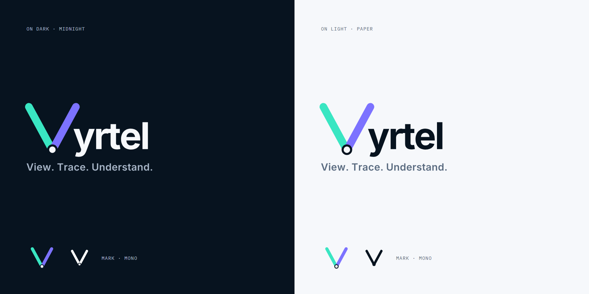
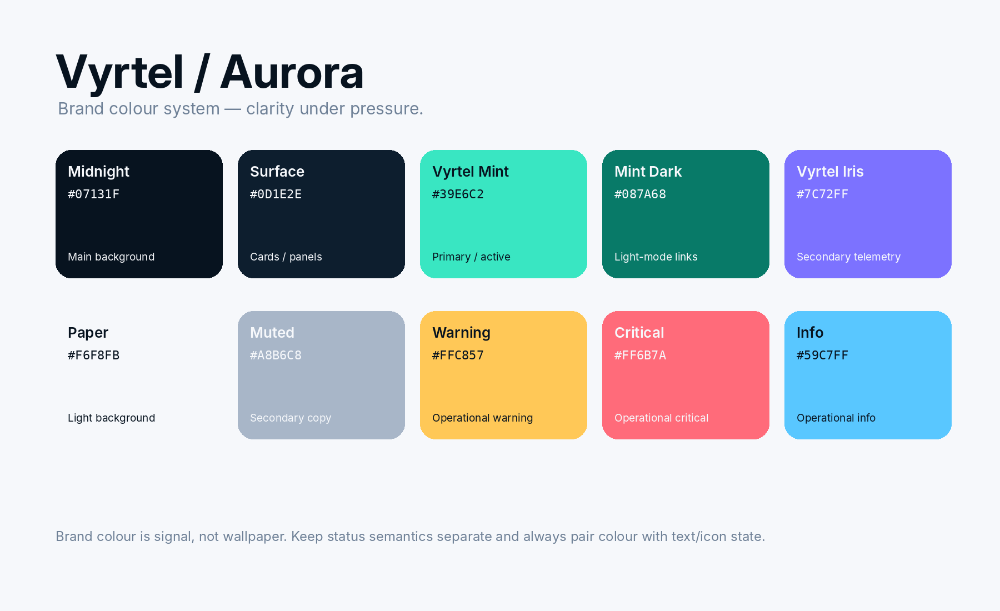

# Vyrtel brand guide

> **View. Trace. Understand.**



**Vyrtel** (VER-tel) is developer-first observability built around clarity under pressure. The name
comes from *view + telemetry*. The tagline is the investigation flow, in this order:

- **View.** Inspect logs, traces, metrics and production events.
- **Trace.** Follow behaviour, causality and relationships across services and signals.
- **Understand.** Reach the context, cause and impact without dashboard archaeology.

The tagline is the primary brand line. Don't stack a second positioning sentence under it in the
lockup; product copy can explain the specific use case where needed.

## Name

- **Vyrtel** in prose and marketing; `vyrtel` where technically natural (binary, CLI, config,
  packages: `vyrtel.toml`, `vyrtel healthcheck`, `@vyrtel/sdk`).
- Never `VYRTEL`, `VyrTel`, `VyRTel`. All-caps only for tiny UI labels that are all-caps anyway.
- Pronounced **VER-tel** (/ˈvɜːtɛl/). State it once in media notes, not on every page.

## Voice

Direct, technical, calm, useful, slightly cheeky. Prefer exact nouns and verbs over marketing
abstractions.

| Do | Don't |
|---|---|
| Checkout latency increased after `payments-api@8f31c2`. See the correlated trace. | Harness the transformative power of next-generation intelligent observability. |
| 14 services affected. One likely cause. | Unlock full-stack insights across your telemetry estate. |
| Cannot reach the Vyrtel server. | Oops! Something went wrong 😢 |

## Logo: [Trace V]yrtel

The Trace V is not an icon beside the wordmark: it **is the first letter**. Its two arms are
independent telemetry paths (Mint, Iris); the node where they converge is correlation into
actionable context.

| File | Use |
|---|---|
| [`vyrtel-wordmark-dark.svg`](vyrtel-wordmark-dark.svg) / [`-light`](vyrtel-wordmark-light.svg) | Wordmark on dark / light backgrounds |
| [`vyrtel-lockup-tagline-dark.svg`](vyrtel-lockup-tagline-dark.svg) / [`-light`](vyrtel-lockup-tagline-light.svg) | Wordmark + tagline (the README header) |
| [`vyrtel-mark-dark.svg`](vyrtel-mark-dark.svg) / [`-light`](vyrtel-mark-light.svg) | Standalone Trace V on a rounded tile |
| [`vyrtel-mark-mono-white.svg`](vyrtel-mark-mono-white.svg) / [`-midnight`](vyrtel-mark-mono-midnight.svg) | One-colour mark |
| [`vyrtel-app-icon.svg`](vyrtel-app-icon.svg) | Favicon / app icon master (mark on a Midnight tile) |
| [`vyrtel-og-1200x630.png`](vyrtel-og-1200x630.png) | Social preview: website `og:image`, and GitHub repo settings → Social preview |

The wordmark and lockup SVGs are **outlined** (the letters are paths), so they render the same
everywhere without Inter installed.

Rules:

- **Proportions**: the V's arms span 1.143× the word's font size, the arm ends sit on the word's
  baseline, and the "y" tucks 0.167 em under the iris arm's top cap. Every implementation (SVGs, web
  UI, website) uses these ratios.
- **Alignment**: align the V's *ink*, not its box, with the surrounding content edge, and space it
  from neighbouring items by the same gap they use between themselves (24 px text-to-text in the
  app's top bar).
- **Clear space**: 0.5× mark height around the wordmark; 0.25× for the standalone mark.
- **Minimum sizes**: mark 16 px; wordmark 96 px wide; wordmark + tagline 220 px wide. Below 96 px use
  the mark alone.
- **Node**: always Paper, ringed in Midnight; only the word colour changes between dark and light.
- **Monochrome**: solid Paper on dark, solid Midnight on light.
- No drop shadows, outlines, glows or gradients on the mark; don't redraw or re-space the letters.

### Compact / animated state

On constrained product surfaces (the app's top bar) the brand starts as the standalone Trace V at its
full master shape. On hover, keyboard focus or an explicit expanded state (`is-expanded`, used on
the sign-in screen and the website header):

1. The correlation node pulses once.
2. `yrtel` reveals from the right (opacity + position); neighbouring items slide along so their
   spacing never changes.

Total ~480 ms, no bounce: precise and instrumental, not playful. `prefers-reduced-motion` disables
it. (The original brand pack also narrowed the arms while collapsed; at top-bar size that reads as a
thin "\/" rather than the mark, so the collapsed V keeps the master geometry.)

### Favicons

The browser tab and app icons are the mark on a Midnight tile, not the transparent mark: at 16 px
recognisability beats transparency, Mint is too faint on light tab strips, and iOS / Android require
opaque icons. They live in [`web/public/`](../../web/public): `favicon.svg`, `favicon.ico` (16–256
px), `apple-touch-icon.png` (180 px) and `icon-192.png` / `icon-512.png` (web app manifest).

## Colour: Aurora



Dark-first. Brand colour is **signal, not wallpaper**.

| Token | Hex | Use |
|---|---|---|
| Midnight | `#07131F` | Main dark background |
| Surface | `#0D1E2E` | Cards, tables, panels, top bar |
| Vyrtel Mint | `#39E6C2` | Primary, active state, highlighted path, healthy |
| Mint Dark | `#087A68` | Links and primary controls on light backgrounds |
| Vyrtel Iris | `#7C72FF` | Secondary telemetry, selection, comparison, debug level |
| Paper | `#F6F8FB` | Light background; text on Midnight |
| Muted | `#A8B6C8` | Secondary copy on dark |

Operational colours stay separate from brand roles, so iris never means "warning":

| State | Dark | Light |
|---|---|---|
| Healthy / OK | `#39E6C2` | `#0E9E85` |
| Warning | `#FFC857` | `#C98A00` |
| Critical / error | `#FF6B7A` | `#E5384C` |
| Info | `#59C7FF` | `#1A8FD1` |

Contrast on Midnight: Paper 17.6:1, Mint 11.8:1, Iris 5.1:1. **Mint on Paper is only ~1.5:1**: never
use bright mint for text or thin strokes in light mode; use Mint Dark (~4.9:1). Iris on Paper (~3.5:1)
is for large/display use only. Never communicate state with colour alone; pair it with a label, icon
or shape (the UI's level badges and alert statuses always carry text).

A machine-readable copy of every token is in [`vyrtel.tokens.json`](vyrtel.tokens.json).

## Typography

| Role | Typeface | Fallbacks |
|---|---|---|
| UI and headings | **Inter** (variable) | `ui-sans-serif, system-ui, -apple-system, "Segoe UI", sans-serif` |
| IDs, code, values, CLI | **IBM Plex Mono** 400/500 | `"SFMono-Regular", Consolas, "Liberation Mono", monospace` |

Both are open source (SIL OFL) and self-hosted (Latin subset, via `@fontsource`): the web UI bundles
them into the binary and the website ships its own copies, so nothing loads fonts from a CDN.
Söhne + Söhne Mono are the paid upgrade path for a later identity pass.

## Motion

Motion represents one of four things: **reveal, correlation, direction or state change**. No
decorative perpetual movement, except intentionally ambient signal indicators (the live-tail dot,
the website's signal line).

| Token | Value | Use |
|---|---|---|
| `--motion-fast` | 140 ms | Hover/press feedback |
| `--motion-base` | 220 ms | Standard interaction |
| `--motion-brand` | 320 ms | Brand word fade-in |
| `--motion-slow` | 480 ms | Brand reveal (word slide, node pulse), sweeps |
| `--ease` | `cubic-bezier(.2,.8,.2,1)` | Standard |
| `--ease-enter` | `cubic-bezier(.16,1,.3,1)` | Entrances |

Cards may lift at most 4 px, strengthen their border toward Mint/Iris and run one low-opacity signal
sweep on hover/focus. No wobble, bounce, 3D tilt or glow.

## Surfaces

- **Product (web UI)**: dark-first and dense, with a light-mode variant; 6 px radii, 13 px base text.
- **Website**: a light Paper field so the dark product windows (screenshots, trace card, terminal)
  do the category signalling, rather than another all-black developer site. Larger radii (8/14/20 px)
  and the plan-card hover treatment on feature cards.
- **Terminal / CLI**: the startup banner is part of the brand: aligned labels, the Web UI URL first,
  "Ready." last.

## Iconography

Lucide-style: 24 × 24 grid, 1.75–2 px strokes, round caps and joins, minimal fills. Filled icons are
reserved for selection, critical alerts and other high-attention states (the app's run button is a
filled play triangle). The Trace V geometry is for branded moments, not product icons.

## Where the brand lives in code

| What | Where |
|---|---|
| App colour, motion and brand CSS | [`web/src/styles.css`](../../web/src/styles.css) (`:root` tokens, `.brand*` rules) |
| App wordmark component | `BrandMark` in [`web/src/App.tsx`](../../web/src/App.tsx) |
| Outlined "yrtel" path data | [`web/src/lib/wordmark.ts`](../../web/src/lib/wordmark.ts) (generated) |
| App fonts | [`web/src/fonts.css`](../../web/src/fonts.css) |
| Favicons and web app manifest | [`web/public/`](../../web/public) |
| Website styles and markup | [`docs/site/`](../site) |
| Logo, palette and social artwork | this folder |

## Regenerating the artwork

The wordmark and lockup SVGs here and `web/src/lib/wordmark.ts` are generated from Inter by
[`generate.mjs`](generate.mjs), so the app, the website and the files never drift apart:

```bash
cd docs && npm ci && npm run brand
```

The mark SVGs, palette and social preview are static files; edit them directly. The social preview
is the wordmark, the tagline headline and one sentence on Midnight with faint Mint/Iris glows; the
logo sheet at the top of this page shows the wordmark and marks on both backgrounds.

## Not yet done

- **No trademark clearance** has been performed for the name, mark or tagline. Clear the word mark
  and the graphic mark separately before public launch.
- Check the remaining domains (`.io`, `.dev`, `.com.au`), a GitHub organisation, container registries
  and package names (crates.io, npm, NuGet) before freezing namespaces. The project lives at
  `github.com/rowan-smith/Vyrtel`, with the website on `vyrtel.com` (GitHub Pages).
